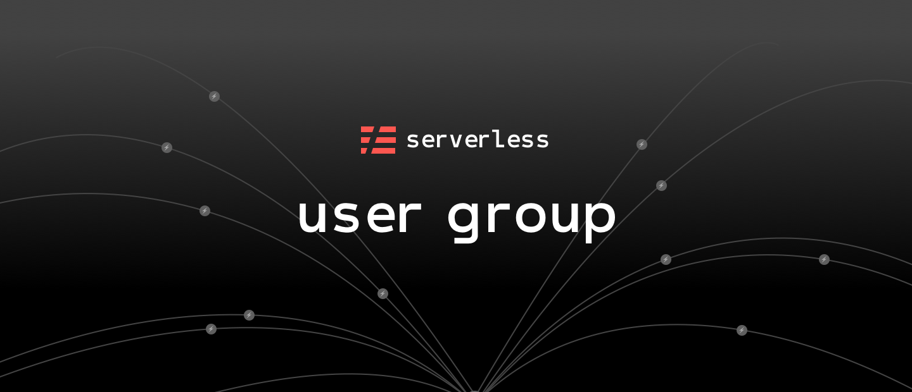

# Serverless Meetup Program

Community-driven Serverless meetups, are hosted locally in cities across the world. Spread the knowledge and experience in building and running applications with serverless architectures at scale, on AWS Lambda, Google Cloud Functions, Azure Functions, IBM Cloud Functions, Kubeless, Webtask, and more. Get together to learn about serverless architectures, event-driven application development, microservices, FaaS and severless computing in general.

* **Do you want to start a Serverless Meetup in your city?** 
* **Do you already have a meetup and want us to help you grow it?** 

Join us to be part of the family of many [Serverless Meetups](https://www.meetup.com/pro/serverless/) across the world. 

## Inquiries

We are here to help the local organizers get started with the meetup! In order for us to help you, we request you please fill up the [inquiry form](https://docs.google.com/forms/d/e/1FAIpQLSfSCMFQc47wn1S0Y2H7LBjuvmoZW57cgBSwKC6vdnbd_7yvWA/viewform), and we will contact you at the earliest.

## Get Involved

* **Attend**: We host Serverless Meetups in [many cities](https://www.meetup.com/pro/serverless/) around the world. Attend the next meetup one near you.
* **Organize**: Don't have a Serverless Meetup in your city, but you’re a serverless enthusiast? Do you have strong local connections and organizational skills? We work closely with local partners to help launch new Serverless Meetups.
* **Speak**: We’re always looking for speakers that want to share their experiences and present about serverless, at the meetup groups. Give a presentation, workshop or lightning talk at one of our meetups.
* **Sponsor**: These meetups wouldn’t be possible without the support of our generous sponsors and community partners. Let us know if you’re interested in hosting a Meetup in your office space, or sponsoring food, drinks or other resources.

## Be an Official Serverless Meetup

With little or no effort, transform your meetup to be an "official" Serverless Meetup. As long as you:

* Register your meetup on Meetup.com
* [Transfer](https://www.meetup.com/help/article/2397734/) your meetup group to the "Serverless Meetup" organizer account
* Add any local co-organizer(s) to build your meetup group [leadership team](https://www.meetup.com/help/article/868703/)
* Use the [Serverless User Group logo](./assets/sug-banner-dark.png) on your meetup page
* Have a meetup at least one each quarter with a future goal of one per month
* Keep the theme of the event focused around serverless technologies
* The meetups including speakers and the talks that are presented, should adhere to the meetup [guidelines](https://www.meetup.com/help/customer/portal/articles/865536-meetup-s-community-guidelines/)

## Expectations from Organizers

We will help you get started, but it is up to you to follow up and finalize things. 

You will coordinate:

* the date and the talks with the speaker(s)
* the availability of the venue
* the sponsorship details with the sponsor
* updating the event information on your Meetup.com page

## Benefits

Apart from the official recognition of being a Serverless Meetup, other benefits include:

* Support the organizer(s) in hosting the meetup
* Send you a Welcome Kit when you join
* Help you find a venue to host
* Help you find speaker(s) to present
* Help you find sponsors
* Help you with potential topics to present
* Send you swag for giveaways: t-shirts, stickers, promo items etc.
* Help you promote the event via social media

## Contact Us

Email us at meetups@serverless.com or chat with us on [Slack on the #meetups channel](https://serverless-contrib.azurewebsites.net/).
